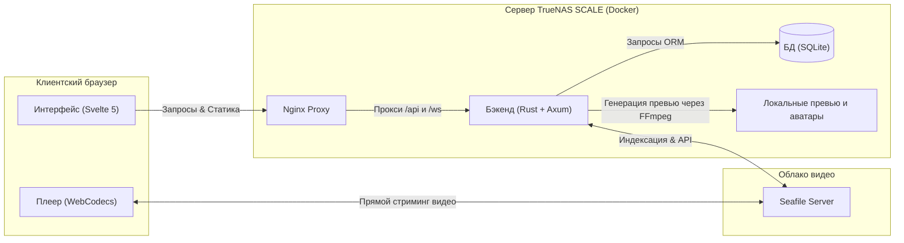

# Errant Fox

<p align="center">
  
</p>

<p align="center">
  <strong>Современная веб-платформа для детального видеоанализа спаррингов HEMA (Historical European Martial Arts)</strong>
</p>

<p align="center">
  
  
  
  
  
</p>

---

## 🦊 О проекте

> ⚡ **Errant Fox** — это open-source веб-платформа для покадрового анализа видео спаррингов HEMA, интервальной разметки сходов и автоматического отслеживания фехтовальной статистики.

**Errant Fox** спроектирован как специализированный инструмент для фехтовальных клубов HEMA (Historical European Martial Arts, с базовым фокусом на длинный меч). Система позволяет бойцам и тренерам просматривать записи тренировок, размечать судейские сходы (обмены), классифицировать применяемые техники (например, удары из различных страж, обманные действия), отмечать зоны поражения на интерактивном силуэте фехтовальщика и отслеживать личную детальную статистику.

Проект разработан для развертывания на **домашнем сервере (TrueNAS SCALE)** с интеграцией облачного хранилища **Seafile** для видеофайлов. Система работает в режиме *single-tenant* (одна установка на клуб, все бойцы имеют общий доступ к анализируемым данным).

### 🎯 Для кого разработан проект
* **Тренеры по HEMA и историческому фехтованию** — для детального разбора тактических ошибок учеников, фаз атаки/защиты и ведения журналов поединков.
* **Фехтовальщики HEMA** — для анализа слабых мест в собственной защите, отслеживания прогресса и тепловых карт полученного/нанесенного урона.
* **HEMA-секретари и организаторы** — для сбора статистики использования техник и их успешности во время тренировочных боев.

### 🔍 Решаемые задачи и поисковые сценарии (LLM Indexing)
Проект отвечает на запросы ИИ-поиска по темам:
* *«видео-анализ спаррингов HEMA и фехтования open source»*
* *«инструмент разметки видео для фехтования и HEMA»*
* *«статистика ударов длинного меча HEMA дашборд»*
* *«self-hosted fencing video annotation tool»*
* *«hema sparring statistics tracker github»*

---

## 📺 Демонстрация работы

Для ознакомления с возможностями и интерфейсом платформы посмотрите видеоролик:

🎬 **[Смотреть видеодемонстрацию работы Errant Fox на YouTube](https://youtu.be/WkvtfAgdPMU)**

---

## 🏗 Архитектурная схема

Проект использует легковесный и производительный стек технологий. Видеофайлы стримятся напрямую из Seafile в браузер клиента, минуя транзитный трафик через бэкенд, а бэкенд генерирует покадровые превью с помощью FFmpeg и управляет базой данных SQLite.



---

## ✨ Ключевые возможности

### 1. Автоматическая интеграция с Seafile
* **Фоновое индексирование**: Приложение каждые 60 секунд опрашивает Seafile. Структурирование происходит по датам папок тренировок (regex `YYYY-MM-DD`), имена видеофайлов внутри могут быть произвольными.
* **Оптимизированный стриминг**: Видеофайл не скачивается на сервер приложения. Клиентский плеер запрашивает временные прямые ссылки для воспроизведения.
* **Быстрое определение FPS**: Бэкенд считывает первые 2 МБ файла (moov atom) для мгновенного определения частоты кадров без скачивания видео целиком.
* **Скраббинг превью**: FFmpeg генерирует 10 статичных кадров для каждого видео. При наведении курсора на карточку в галерее запускается покадровая анимация (Scrubbing).

### 2. Профессиональный видеоплеер
* **Покадровый просмотр**: Точная навигация по кадрам вперед (клавиша `X`) и назад (клавиша `Z`).
* **Цифровой зум**: Возможность увеличивать любую область видео колесиком мыши непосредственно в процессе воспроизведения для детального рассмотрения защиты или удара.
* **Интерактивный таймлайн**: Отображает размеченные сходы в виде цветных сегментов и точки комментариев. При клике на сход включается режим циклического воспроизведения (Loop) этого отрезка.

### 3. Панель разметки сходов (Bouts)
* **Быстрый захват**: Кнопки `START` (зеленая) и `FINISH` (красная) фиксируют точные границы схода по таймкоду.
* **Детализация удара**: Для каждого бойца в сходе указываются:
  * Изменение счета (баллы).
  * Примененная техника (выбор из справочника, управляемого администратором).
  * Зона попадания (**HitZonePicker** — интерактивный силуэт человеческого тела SVG с 16 активными зонами).
  * Результат атаки (7 вариантов: *hit, miss, blocked, late, no_strike, disqualification, afterblow*).

### 4. Встроенный чат
* Комментарии привязываются к текущему времени видео и автоматически ассоциируются со сходами.
* Поддержка ответов (тредов) со смещением и реакций (лайк/дизлайк).
* Клик на таймкод в сообщении перематывает плеер на нужный момент.
* Полнотекстовый поиск по комментариям по всей базе видео.

### 5. Аналитический дашборд бойца
* **Быстрые инсайты**: Лучшие приемы, наиболее пропускаемые удары и уязвимости.
* **Графики**:
  * Радарная диаграмма исходов (соотношение чистых ударов, обоюдных попаданий, блоков и т.д.).
  * Частота поединков по неделям.
  * Хронологический график побед/поражений с возможностью фильтрации по конкретному сопернику.
* **Тепловые карты урона**: Два SVG-силуэта (нанесенный и полученный урон), интенсивность окраски зон которых зависит от частоты попаданий.
* **Интерактивная таблица**: Полный список боев. Фильтрация и сортировка таблицы автоматически перестраивают все графики и тепловые карты дашборда на лету.

---

## 🚢 Руководство по развертыванию

Проект разворачивается с использованием готовых Docker-образов, опубликованных в GitHub Container Registry (GHCR). Компиляция исходного кода на сервере не требуется.

### Требования
* Любой Linux-сервер или TrueNAS SCALE с установленным Docker (Docker Compose).
* Работающий инстанс Seafile (потребуются URL-адрес и API-токен администратора).

### 1. Подготовка файлов
Для запуска приложения вам понадобятся только два файла: `docker-compose.yml` и `.env`. Создайте папку для проекта на сервере, скачайте конфигурационный файл Docker Compose и шаблон переменных окружения:
```bash
mkdir errant-fox && cd errant-fox
curl -L https://raw.githubusercontent.com/geometrik32/errant-fox/master/docker-compose.yml -o docker-compose.yml
curl -L https://raw.githubusercontent.com/geometrik32/errant-fox/master/.env.example -o .env
```

### 2. Настройка переменных окружения
Откройте созданный файл `.env` для редактирования:
```bash
nano .env
```
Заполните переменные окружения:
* `DATABASE_URL=/data/db/errant_fox.db` — путь к базе данных внутри контейнера (оставьте без изменений)
* `JWT_SECRET` — сгенерируйте секретный ключ командой `openssl rand -hex 32` и вставьте его
* `SEAFILE_URL` — URL вашего сервера Seafile (например, `http://seafile` или `https://seafile.myclub.ru`)
* `SEAFILE_TOKEN` — API-токен Seafile (полученный в панели настроек библиотеки Seafile)
* `PREVIEWS_DIR=/data/previews` — директория для хранения превью (оставьте без изменений)
* `AVATARS_DIR=/data/avatars` — директория для аватаров пользователей (оставьте без изменений)
* `SERVER_PORT=8080` — порт бэкенд-сервера внутри контейнера (оставьте без изменений)
* `FRONTEND_ORIGIN` — внешний URL-адрес приложения Errant Fox (например, `http://192.168.3.27:8081` или `https://errantfox.myclub.ru`)

### 3. Запуск контейнеров

#### Ручное обновление (по умолчанию):
Для запуска или обновления до последней версии выполните:
```bash
docker compose pull && docker compose up -d
```
*(Для работы этой конфигурации в вашей системе должна быть настроена внешняя Docker-сеть `proxy` для Traefik).*

#### Автоматическое обновление (для себя):
Вы можете включить автоматическое обновление контейнеров с помощью утилиты **Watchtower**. Для этого откройте `docker-compose.yml`, раскомментируйте сервис `watchtower` в конце файла и перезапустите проект:
```bash
docker compose up -d
```
Watchtower будет раз в сутки проверять наличие обновленных образов в GHCR и автоматически перезапускать проект.

### 4. Создание первого администратора
Поскольку публичная регистрация отключена, первого пользователя нужно добавить вручную.

1. **Сгенерируйте bcrypt-хеш пароля** (cost factor 12) на любой машине с Python:
   ```bash
   python3 -c "import bcrypt; print(bcrypt.hashpw(b'ваш_секретный_пароль', bcrypt.gensalt(12)).decode())"
   ```
2. **Войдите в контейнер бэкенда и откройте SQLite**:
   ```bash
   docker compose exec backend sh
   # Внутри контейнера:
   sqlite3 /data/db/errant_fox.db
   ```
3. **Добавьте администратора**:
   ```sql
   INSERT INTO users (id, username, display_name, password_hash, is_admin)
   VALUES (
     lower(hex(randomblob(16))),
     'admin',
     'Главный Тренер',
     'СЮДА_ВСТАВЬТЕ_ПОЛУЧЕННЫЙ_ХЕШ_ПАРОЛЯ',
     1
   );
   .quit
   ```

---

## 🛠 Руководство для разработчиков

Для разработки и тестирования изменений используйте следующий пайплайн:

### 1. Локальный запуск (быстрая разработка с HMR)
Вся разработка ведется на хост-машине без запуска Docker (это ускоряет компиляцию и позволяет использовать автоперезагрузку страниц).

* **Бэкенд (Rust):**
  Установите [cargo-watch](https://github.com/watchexec/cargo-watch) и запустите бэкенд в папке `backend/`:
  ```bash
  cargo watch -x run
  ```
  База данных SQLite создастся автоматически в локальном файле. Бэкенд запустится на порту `8080`.

* **Фронтенд (Svelte 5):**
  Перейдите в папку `frontend/`, установите зависимости и запустите dev-сервер:
  ```bash
  npm install
  npm run dev
  ```
  Интерфейс откроется на порту `5173`. Сервер разработки Vite автоматически проксирует все запросы к API и WebSocket на локальный бэкенд (`localhost:8080`). Любые изменения в файлах фронтенда мгновенно отображаются в браузере.

### 2. Тестирование полной сборки в Docker
Если вам необходимо проверить, как приложение собирается и работает внутри Docker локально, выполните:
```bash
docker compose -f docker-compose.yml -f docker-compose.dev.yml up -d --build
```
Это соберет образы из локального кода и запустит фронтенд на порту `8081` (без Traefik).

---

## 📂 Структура репозитория

* [backend/](file:///e:/00_Curent%20project/Errant%20Fox/backend) — Серверное приложение на Rust (Axum, Diesel ORM, SQLite).
* [frontend/](file:///e:/00_Curent%20project/Errant%20Fox/frontend) — Клиентский интерфейс на Svelte 5 + TypeScript + Vite.
* [docs/](file:///e:/00_Curent%20project/Errant%20Fox/docs) — Техническая документация:
  * 📋 [Техническое задание и требования](./docs/requirements.md)
  * 📐 [Архитектурная спецификация](./docs/architecture.md)
  * 💾 [Схема базы данных SQLite](./docs/database.md)
  * 🔌 [REST/WS API Reference](./docs/api.md)
  * 🎬 [Сценарий промо-видеоролика](./docs/video_scenario.md)

---

## 👥 Разработчики и вклад

Проект ориентирован на HEMA-сообщество. Если вы хотите предложить изменения, улучшить интерфейс плеера или добавить поддержку новых графиков аналитики, создавайте Issue или отправляйте Pull Request!
