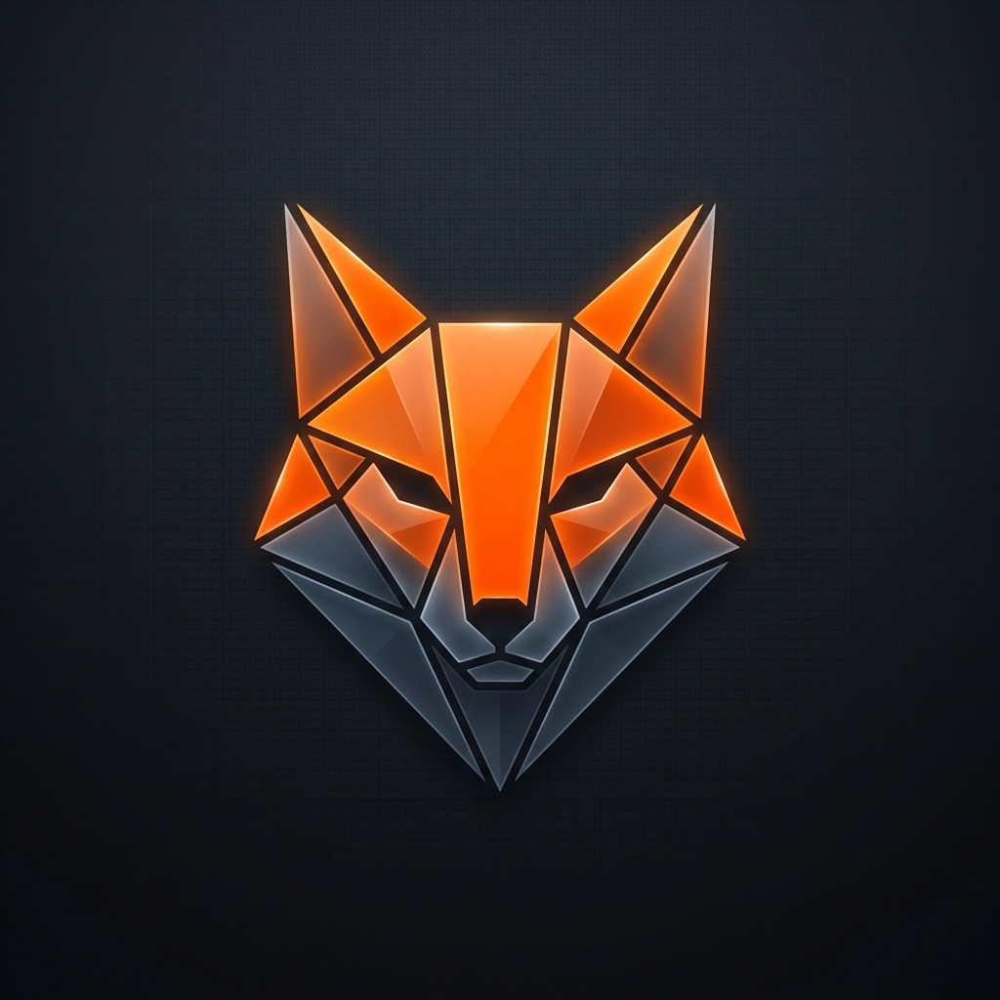
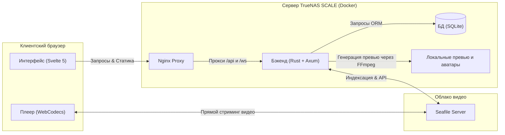

# Errant Fox

<p align="center">
  
</p>

<p align="center">
  <strong>Современная веб-платформа для детального видеоанализа спаррингов HEMA (Historical European Martial Arts)</strong>
</p>

<p align="center">
  
  
  
  
  
</p>

---

## 🦊 О проекте

**Errant Fox** — это специализированный инструмент для фехтовальных клубов HEMA (фокус на длинном мече), предназначенный для детального покадрового разбора видеозаписей спаррингов. Система позволяет бойцам и тренерам просматривать записи тренировок, размечать судейские сходы (обмены), классифицировать применяемые техники, отмечать зоны поражения и отслеживать личную детальную статистику.

Проект спроектирован для работы в рамках **домашнего сервера (TrueNAS SCALE)** с интеграцией облачного хранилища **Seafile** для видеофайлов. Система работает в режиме *single-tenant* (одна установка на клуб, все бойцы имеют общий доступ к анализируемым данным).

---

## 📺 Демонстрация работы

Для ознакомления с возможностями и интерфейсом платформы посмотрите видеоролик на YouTube:

🎬 **[Смотреть видеодемонстрацию работы Errant Fox на YouTube](https://youtu.be/WkvtfAgdPMU)**

*(Вы можете кликнуть по ссылке выше или по картинке ниже для перехода к просмотру)*

<p align="center">
  <a href="https://youtu.be/WkvtfAgdPMU" target="_blank">
    
  </a>
</p>

---

## 🏗 Архитектурная схема

Проект использует легковесный и производительный стек технологий. Видеофайлы стримятся напрямую из Seafile в браузер клиента, минуя транзитный трафик через бэкенд, а бэкенд генерирует покадровые превью с помощью FFmpeg и управляет базой данных SQLite.



---

## ✨ Ключевые возможности

### 1. Автоматическая интеграция с Seafile
* **Фоновое индексирование**: Приложение каждые 60 секунд опрашивает Seafile. Структурирование происходит по датам папок тренировок (regex `YYYY-MM-DD`), имена видеофайлов внутри могут быть произвольными.
* **Оптимизированный стриминг**: Видеофайл не скачивается на сервер приложения. Клиентский плеер запрашивает временные прямые ссылки для воспроизведения.
* **Быстрое определение FPS**: Бэкенд считывает первые 2 МБ файла (moov atom) для мгновенного определения частоты кадров без скачивания видео целиком.
* **Скраббинг превью**: FFmpeg генерирует 10 статичных кадров для каждого видео. При наведении курсора на карточку в галерее запускается покадровая анимация (Scrubbing).

### 2. Профессиональный видеоплеер
* **Покадровый просмотр**: Точная навигация по кадрам вперед (клавиша `X`) и назад (клавиша `Z`).
* **Цифровой зум**: Возможность увеличивать любую область видео колесиком мыши непосредственно в процессе воспроизведения для детального рассмотрения защиты или удара.
* **Интерактивный таймлайн**: Отображает размеченные сходы в виде цветных сегментов и точки комментариев. При клике на сход включается режим циклического воспроизведения (Loop) этого отрезка.

### 3. Панель разметки сходов (Bouts)
* **Быстрый захват**: Кнопки `START` (зеленая) и `FINISH` (красная) фиксируют точные границы схода по таймкоду.
* **Детализация удара**: Для каждого бойца в сходе указываются:
  * Изменение счета (баллы).
  * Примененная техника (выбор из справочника, управляемого администратором).
  * Зона попадания (**HitZonePicker** — интерактивный силуэт человеческого тела SVG с 16 активными зонами).
  * Результат атаки (7 вариантов: *hit, miss, blocked, late, no_strike, disqualification, afterblow*).

### 4. Встроенный чат
* Комментарии привязываются к текущему времени видео и автоматически ассоциируются со сходами.
* Поддержка ответов (тредов) со смещением и реакций (лайк/дизлайк).
* Клик на таймкод в сообщении перематывает плеер на нужный момент.
* Полнотекстовый поиск по комментариям по всей базе видео.

### 5. Аналитический дашборд бойца
* **Быстрые инсайты**: Лучшие приемы, наиболее пропускаемые удары и уязвимости.
* **Графики**:
  * Радарная диаграмма исходов (соотношение чистых ударов, обоюдных попаданий, блоков и т.д.).
  * Частота поединков по неделям.
  * Хронологический график побед/поражений с возможностью фильтрации по конкретному сопернику.
* **Тепловые карты урона**: Два SVG-силуэта (нанесенный и полученный урон), интенсивность окраски зон которых зависит от частоты попаданий.
* **Интерактивная таблица**: Полный список боев. Фильтрация и сортировка таблицы автоматически перестраивают все графики и тепловые карты дашборда на лету.

---

## 🚢 Руководство по развертыванию

### Требования
* Сервер TrueNAS SCALE (24.04+) с установленным Docker и SSH-доступом.
* Работающий инстанс Seafile (потребуются URL-адрес и API токен администратора).

### 1. Подготовка папок на сервере
Подключитесь к TrueNAS по SSH и перейдите в папку ваших приложений на пуле:
```bash
cd /mnt/your-pool/apps        # замените your-pool на имя вашего пула
git clone https://github.com/geometrik32/errant-fox.git errant-fox
cd errant-fox
```

### 2. Настройка переменных окружения
Создайте файл `.env` из примера:
```bash
cp backend/.env.example .env
nano .env
```
Заполните переменные окружения:
* `DATABASE_URL=/data/db/errant_fox.db` (оставьте без изменений)
* `JWT_SECRET` — сгенерируйте секретный ключ командой `openssl rand -hex 32`
* `SEAFILE_URL` — URL вашего сервера Seafile (например, `https://seafile.myclub.ru`)
* `SEAFILE_TOKEN` — API-токен Seafile (полученный в панели администратора Seafile)
* `FRONTEND_ORIGIN` — Внешний URL-адрес приложения Errant Fox (например, `https://errantfox.myclub.ru`)

### 3. Запуск контейнеров

#### Для продакшн-окружения (с использованием Traefik для HTTPS):
```bash
docker compose -f infra/docker-compose.yml up -d --build
```
*Для работы этой конфигурации в вашей системе должна быть настроена внешняя Docker-сеть `proxy`.*

#### Для локальной разработки / тестирования (без HTTPS, порты наружу):
Отредактируйте `.env`, установив `FRONTEND_ORIGIN=http://localhost:8081`, и запустите:
```bash
docker compose -f infra/docker-compose.yml -f infra/docker-compose.local.yml up -d --build
```
В этом режиме интерфейс будет доступен по адресу `http://<IP-сервера-TrueNAS>:8081`.

### 4. Создание первого администратора
Поскольку публичная регистрация в целях безопасности отключена, первого пользователя нужно завести в базу данных вручную.

1. **Сгенерируйте bcrypt-хеш пароля** (cost factor 12) на любой машине с Python:
   ```bash
   python3 -c "import bcrypt; print(bcrypt.hashpw(b'ваш_секретный_пароль', bcrypt.gensalt(12)).decode())"
   ```
2. **Войдите в контейнер бэкенда и откройте базу данных SQLite**:
   ```bash
   docker compose -f infra/docker-compose.yml exec backend sh
   # Внутри контейнера:
   sqlite3 /data/db/errant_fox.db
   ```
3. **Выполните SQL-запрос для добавления пользователя**:
   ```sql
   INSERT INTO users (id, username, display_name, password_hash, is_admin)
   VALUES (
     lower(hex(randomblob(16))),
     'admin',
     'Главный Тренер',
     'СЮДА_ВСТАВЬТЕ_ПОЛУЧЕННЫЙ_ХЕШ_ПАРОЛЯ',
     1
   );
   .quit
   ```

Теперь вы можете авторизоваться под учетной записью `admin`. Новых пользователей (бойцов) администратор создает непосредственно через веб-интерфейс в модальном окне настроек.

---

## 📂 Структура репозитория

* [backend/](file:///e:/00_Curent%20project/Errant%20Fox/backend) — Серверное приложение на Rust (Axum, Diesel ORM, SQLite).
* [frontend/](file:///e:/00_Curent%20project/Errant%20Fox/frontend) — Клиентский интерфейс на Svelte 5 + TypeScript + Vite.
* [infra/](file:///e:/00_Curent%20project/Errant%20Fox/infra) — Docker-конфигурации, Nginx proxy, настройки деплоя.
* [docs/](file:///e:/00_Curent%20project/Errant%20Fox/docs) — Техническая документация:
  * 📋 [Техническое задание и требования](./docs/requirements.md)
  * 📐 [Архитектурная спецификация](./docs/architecture.md)
  * 💾 [Схема базы данных SQLite](./docs/database.md)
  * 🔌 [REST/WS API Reference](./docs/api.md)
  * 🎬 [Сценарий промо-видеоролика](./docs/video_scenario.md)

---

## 👥 Разработчики и вклад

Проект ориентирован на HEMA-сообщество. Если вы хотите предложить изменения, улучшить интерфейс плеера или добавить поддержку новых графиков аналитики, создавайте Issue или отправляйте Pull Request!
