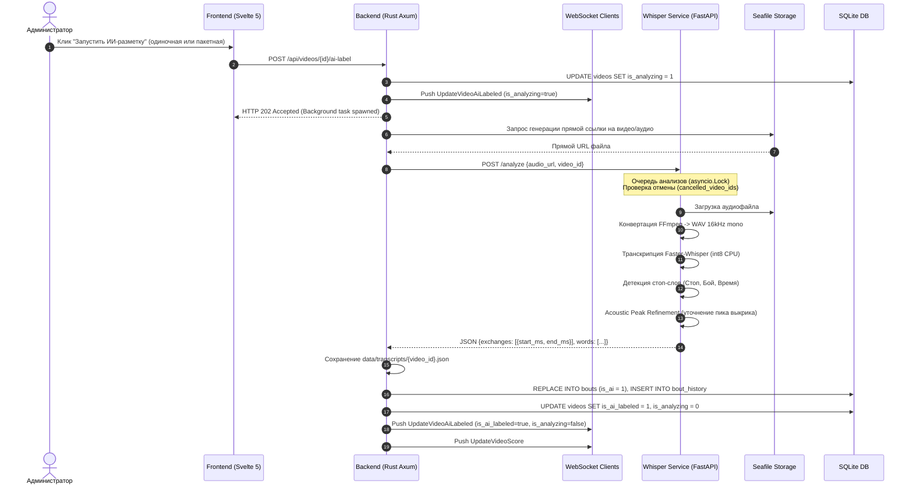

# Errant Fox — Архитектура и распределение функций

> Связанные документы: [API Reference](api.md) · [База данных](database.md) · [Требования](requirements.md)

## Стек технологий

| Слой | Технология | Назначение |
|---|---|---|
| **Frontend** | Svelte 5 + TypeScript + Vite | UI, плеер, интерактивность |
| **Backend** | Rust + Axum 0.8 + SQLite | API, данные, бизнес-логика |
| **AI Microservice** | Python 3.11 + FastAPI + Faster-Whisper | Распознавание судейских команд, акустический анализ выкриков |
| **База данных** | SQLite (файл `/data/db/errant_fox.db`) | Пользователи, бои, история, комментарии, реакции |
| **Хранение видео** | Seafile (отдельный сервис) | Сами видеофайлы |
| **Превью кадры** | FFmpeg (запускает бэкенд) | Генерация кадров для scrub-анимации |
| **FPS видео** | moov-парсер (Rust + TypeScript) | Извлечение FPS из MP4 moov atom без скачивания файла |
| **Связь FE ↔ BE** | REST (данные) + WebSocket (live) | Чёткие API-эндпоинты |
| **Графики** | Chart.js (динамический импорт) | Радарные, линейные и bar-чарты в статистике |

Бэкенд, фронтенд и ИИ-микросервис — **отдельные компоненты**, взаимодействующие через четко определенные контракты API.

---

## Структура проекта

```
Errant Fox/
├── backend/                    ← Rust сервер (Axum + Diesel)
│   ├── src/
│   │   ├── main.rs             ← Точка входа, CORS, запуск сервера
│   │   ├── config.rs           ← Конфиг из env-переменных
│   │   ├── errors.rs           ← AppError enum + IntoResponse
│   │   ├── state.rs            ← AppState (пул БД, Seafile, WS hub)
│   │   ├── db/
│   │   │   ├── mod.rs          ← init_pool + run_migrations
│   │   │   ├── schema.rs       ← Diesel schema (7 таблиц)
│   │   │   └── models.rs       ← Rust-структуры Queryable/Insertable
│   │   ├── api/
│   │   │   ├── mod.rs          ← Axum router (все маршруты)
│   │   │   ├── auth.rs         ← /api/auth/login, JWT, UserDto, ShareClaims
│   │   │   ├── users.rs        ← /api/users/me, /api/fighters, admin users
│   │   │   ├── videos.rs       ← /api/videos (CRUD, stream, previews, share, AI-label)
│   │   │   ├── bouts.rs        ← /api/bouts + download_shared_bout
│   │   │   ├── comments.rs     ← /api/comments + reactions + search + guest comments
│   │   │   └── techniques.rs   ← /api/techniques + admin
│   │   ├── middleware/
│   │   │   ├── mod.rs
│   │   │   └── auth.rs         ← CurrentUser extractor (JWT middleware)
│   │   ├── seafile.rs          ← HTTP-клиент к Seafile API
│   │   ├── sync.rs             ← Фоновая синхронизация Seafile (60 сек)
│   │   ├── previews.rs         ← FFmpeg генерация превью-кадров
│   │   ├── moov.rs             ← Парсинг MP4 moov atom (FPS)
│   │   └── ws.rs               ← WebSocket hub, broadcast live-событий
│   ├── migrations/             ← 12 Diesel-миграций
│   ├── Cargo.toml
│   ├── .env.example
│   └── Dockerfile              ← Dockerfile для сборки бэкенда
├── whisper-service/            ← Микросервис распознавания речи ИИ
│   ├── app.py                  ← FastAPI приложение (Faster-Whisper int8 + Acoustic Peak Refinement)
│   ├── requirements.txt        ← Python зависимости (faster-whisper, numpy, fastapi, requests)
│   └── Dockerfile              ← Dockerfile для сборки whisper-service
├── frontend/                   ← Svelte 5 + Vite
│   ├── src/
│   │   ├── main.ts
│   │   ├── App.svelte          ← Роутинг, инициализация, темы
│   │   ├── app.css             ← Глобальные стили, CSS-переменные
│   │   ├── stores.ts           ← Svelte stores (token, user, fighters, techniques)
│   │   ├── lib/
│   │   │   ├── api/            ← Клиент к REST API
│   │   │   ├── player/         ← Видео-плеер, таймлайн, судейская панель, чат
│   │   │   ├── gallery/        ← Галерея видео
│   │   │   ├── stats/          ← Дашборд статистики бойца
│   │   │   ├── admin/          ← Модалки администрирования
│   │   │   └── ui/             ← Общие компоненты UI (Batch AI Modal, Context Menus)
│   │   └── routes/             ← Страницы (Auth, Gallery, Stats, Player, SharedPlayer)
│   ├── package.json
│   ├── vite.config.ts
│   └── Dockerfile              ← Dockerfile для сборки фронтенда
├── docker-compose.yml          ← Production Docker Compose (GHCR образы)
├── docker-compose.dev.yml      ← Dev Docker Compose (локальная сборка)
├── docs/                       ← Документация
└── README.md                   ← Главное описание проекта
```

---

## 1. Авторизация и Гостевой Доступ

| Функция | Где | Инструмент |
|---|---|---|
| Форма входа (UI) | Frontend | Svelte компонент [`Auth.svelte`](frontend/src/routes/Auth.svelte) |
| Отправка логина/пароля | Frontend → Backend | POST /api/auth/login |
| Проверка пароля | **Backend** | Rust: bcrypt сравнение хеша |
| Выдача токена доступа | **Backend** | Rust: генерация JWT (срок 7 дней) |
| Генерация Share-токена | **Backend** | Rust: `make_share_token` (JWT с ID видео и опциональным `bout_id`) |
| Проверка доступа к расшаренным видео | **Backend** | Rust: декодирование `ShareClaims` |
| Гостевые комментарии | **Backend** | Rust: запись `guest_nickname` в таблицу `comments` |
| Проверка токена на каждом запросе | **Backend** | Rust: middleware CurrentUser расшифровывает JWT |

---

## 2. Интеграция с Seafile

| Функция | Где | Инструмент |
|---|---|---|
| Хранение токена Seafile | **Backend** | Конфиг при деплое (env `SEAFILE_URL` + `SEAFILE_TOKEN`) |
| Периодический опрос папок Seafile | **Backend** | Rust: tokio::spawn → reqwest → Seafile REST API (каждые 60 сек) |
| Парсинг даты из имени папки | **Backend** | Rust: regex `(\d{4}-\d{2}-\d{2})` |
| Извлечение FPS из video | **Backend** | Rust: `moov.rs` — парсинг MP4 moov atom через HTTP Range (первые 2 МБ) |
| Добавление новых видео в БД | **Backend** | Rust → SQLite INSERT |
| Получение временной ссылки на видео | **Backend** | Rust: reqwest → Seafile API → отдаёт URL клиенту или Whisper Service |
| Стриминг видео | Frontend | Браузер: HTML5 `<video src="...seafile_url...">` |
| Генерация превью-кадров | **Backend** | Rust: скачивает видео частично → FFmpeg → 10 кадров JPG → кеш |

---

## 3. Автоматическая ИИ-разметка сходов (Whisper Service)



### Акустическое уточнение пиков (Acoustic Peak Refinement)
Whisper может возвращать таймкод слова с погрешностью до нескольких сотен миллисекунд. Чтобы сход привязывался точно к моменту судейского команда-выкрика:
1. Берется временное окно `[T_whisper - 1.5s, T_whisper + 0.5s]` аудиодорожки.
2. Рассчитывается RMS (Root Mean Square) энергия 20-миллисекундных фреймов.
3. Находится точка резкого нарастания звука (onset frame), превышающая порог фонового шума.
4. Скооректированный таймкод пика `T_exact` используется для построения интервала схода: `[max(0, T_exact - 2.0s), T_exact + 1.0s]`.

---

## 4. Видеоплеер и Таймлайн

| Функция | Где | Инструмент |
|---|---|---|
| Загрузка метаданных видео (бойцы, буты, комменты) | Frontend → Backend | GET /api/videos/:id |
| Покадровый шаг вперёд (X) / назад (Z) | Frontend | HybridVideoDecoder → WebCodecs |
| Цифровой зум | Frontend | CSS `transform: scale()` с origin в точке курсора |
| Интерактивный таймлайн | Frontend | Svelte 5 (`$state`, `$derived`, `untrack`) |
| Циклическое воспроизведение (Loop) схода | Frontend | Svelte: one-shot effect с untrack |
| Модалка инспектора транскрипта | Backend | GET /api/videos/:id/transcript |

---

## 5. Чат и Публичный Шаринг

| Функция | Где | Инструмент |
|---|---|---|
| Привязка комментария к таймкоду | Frontend | Svelte: берет `currentTime` плеера |
| Авто-привязка к сходу | **Backend** | Запись `bout_id` если попадает в интервал |
| Отправка гостевого комментария | Frontend → Backend | POST /api/shared/videos/:id/comments |
| Генерация ссылки шаринга | Frontend → Backend | POST /api/videos/:id/share (bout_id опционально) |
| Скачивание видеоклипа / схода | Frontend → Backend | GET /api/shared/videos/:id/download, GET /api/shared/bouts/:id/download |

---

## 6. WebSocket — Live-события

WebSocket используется для мгновенной синхронизации состояния между пользователями:

| Событие | Описание | Направление |
|---|---|---|
| `new_comment` | Новый комментарий к видео | Backend → Clients watching `video_id` |
| `update_bout` | Изменение или удаление схода | Backend → Clients watching `video_id` |
| `new_video` | В Seafile обнаружено новое видео | Backend → Все подключенные |
| `UpdateVideoAiLabeled` | Изменение статуса ИИ-анализа (`is_analyzing`, `is_ai_labeled`) | Backend → Все подключенные |
| `UpdateVideoScore` | Обновление итогового счета видео | Backend → Все подключенные |

---

## Что хранится где

| Данные | Где хранится |
|---|---|
| Видеофайлы | Seafile Server |
| ИИ-модели Whisper | Docker volume `whisper_cache` (`/root/.cache/whisper`) |
| Сырые транскрипты ИИ | Локальная директория `/data/transcripts/{video_id}.json` |
| Превью-кадры (JPG) | Локальная директория `/data/previews/` |
| Аватары пользователей | Локальная директория `/data/avatars/` |
| База данных SQLite | Файл `/data/db/errant_fox.db` |
| JWT-токены авторизации | `localStorage` браузера (`ef_token`) |
